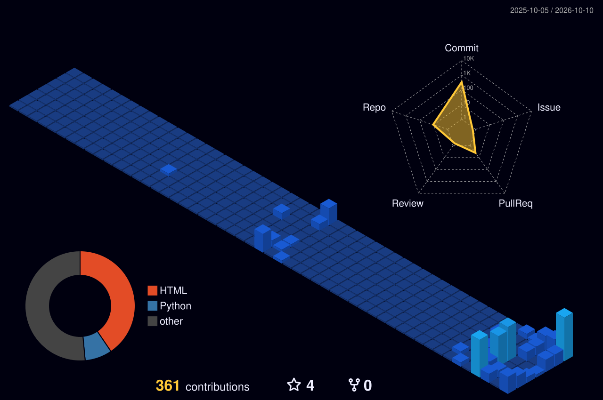

<!-- ================= 1 · HERO ================= -->

<!-- ================= 2 · ABOUT / DOSSIER ================= -->

<!-- ================= 3 · TECH STACK ORBIT ================= -->

<!-- ================= 4 · ID BADGE + DASHBOARD ================= -->

 

  
  
  
  

---

### 🛡️ About Me

Cybersecurity undergraduate and systems builder working at the intersection of Linux endpoint defense, offensive penetration testing, and autonomous AI microservices. I build deterministic defensive tooling and real-time containment pipelines, and I use LLMs as accelerators for triage and automation, not as a substitute for understanding the underlying systems.

- 🎓 **Education:** BS Cyber Security, University of Central Punjab (UCP), Lahore
- 🌐 **Community:** Microsoft Learn Student Ambassador (MLSA)
- 🔒 **Core Focus:** Web penetration testing, Linux endpoint containment, network auditing, Azure security compliance
- 📡 **Currently:** Hardening threat-telemetry parsers and memory-inspection scripts; building LLM-assisted SOC triage playbooks
- 🤝 **Open to:** Internships, security research collaboration, and open-source tooling

---

### ⚙️ Featured Projects

| Project | Description | Tech Stack | Status |
| :--- | :--- | :--- | :---: |
| 🤖 **`LocalBiz AI`** | Autonomous conversational agent and workflow orchestrator for local businesses | `FastAPI` • `Groq LLaMA` • `Docker` • `Gemini API` | `Active` 🟢 |
| 🛡️ **`auto-incident-responder`** | Real-time Linux endpoint telemetry monitoring with an automated containment engine | `Python` • `FastAPI` • `WebSockets` • `Kernel Signals` | `Active Defense` 🟢 |
| ⚡ **`RetailFlow-POS`** | Zero-dependency, offline-first billing and inventory system with local transaction cache | `Vanilla JS` • `LocalStorage Engine` • `Zero-Latency` | `Offline 1st` 🟢 |

Explore all repositories: <a href="https://github.com/umairs759?tab=repositories">github.com/umairs759?tab=repositories</a>

---

### 🏗️ Engineering Scope

| Domain | Production Scope & Execution |
| :--- | :--- |
| **Cybersecurity & Systems** | Linux kernel hardening, active-defense containment scripts, packet auditing, cloud compliance |
| **Applied AI & LLM Systems** | Fast LPU inference pipelines, local model execution, agent tool-calling routers, structured JSON output |
| **Backend & Microservices** | High-throughput asynchronous REST services, webhook ingestion, containerized deployments |
| **Frontend & 3D Web** | Interactive WebGL scenes, offline-first UI architectures, deterministic state handling |
| **DevOps & Automations** | CI/CD pipelines, scheduled cron telemetry automations, API integration testing |

---

### 🏅 Certifications & Credentials

| Credential | Issuing Body | Domain Focus | Status |
| :--- | :---: | :--- | :---: |
| **Cloud Security & Monitoring Tasks** | Microsoft Applied Skills | Azure security baselines, alert monitoring, IAM | `Verified` 🟢 |
| **Foundations of Cybersecurity** | Google (Coursera) | Frameworks (NIST, CIA triad), threat intel, asset defense | `Verified` 🟢 |
| **Cybersecurity Job Simulation** | Deloitte (Forage) | Network packet inspection, triage, log investigation | `Completed` 🟢 |
| **SQL Data Querying & Governance** | Microsoft Learn | Relational querying, RBAC governance, access auditing | `In progress` ⏳ |

---

### 🏆 Honors & Milestones

- 🎖️ **Grade 2A Placement:** Alibaba Cloud AI Hackathon Pakistan
- 🌐 **Top 20% Global Rank:** International Research Olympiad (IRO)
- 🧪 **Hands-on Lab Practice:** TryHackMe & PortSwigger Web Security Academy

---

### 🌃 Contribution City
<!-- Generated daily by .github/workflows/profile-3d.yml -->
<picture>
  <source media="(prefers-color-scheme: dark)" srcset="profile-3d-contrib/profile-night-view.svg">
  
</picture>

 

### 📊 GitHub Stats

<table align="center" border="0" cellpadding="0" cellspacing="0">
  <tr>
    <td>
      
    </td>
    <td>
      
    </td>
  </tr>
  <tr>
    <td colspan="2" align="center">
      
    </td>
  </tr>
</table>

 
<!-- ================= 5 · CONNECT & COLLABORATION HUB ================= -->

  

### ⚡ Initiate Secure Handshake // Let's Connect & Collaborate

> **Looking to collaborate on defensive security tooling, red/blue team research, autonomous AI workflows, or open-source initiatives?** Feel free to drop a signal across any channel below.

 

<!-- Collaboration Telemetry Matrix -->
| 🎯 Collaboration Domains | 📡 Telemetry & SLA | 🤝 Direct Signal Uplink |
| :--- | :---: | :--- |
| • Web Penetration Testing & Defense • Active Linux Endpoint Containment • Autonomous Agentic AI Pipelines |    | • [📩 Direct Dispatch (Email)](mailto:umairghaffar759@gmail.com) • [💼 Professional Network (LinkedIn)](https://linkedin.com/in/umairs759) • [🌐 Production Hub (Portfolio)](https://umairs759.github.io/Muhammad-Umair-Portfolio/) |

 

<!-- Sleek Tactical Action Badges -->

  
  &nbsp;
  
  &nbsp;
  

 

 
🛡️ System Telemetry: Encrypted & Operational

